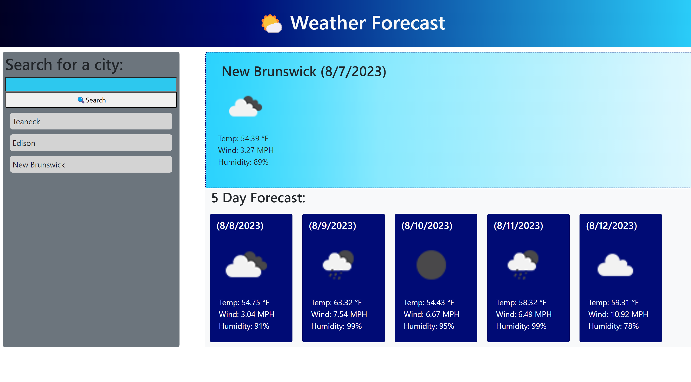

# Weather Forecast

## Description
A website that displays the weather for the current day and the next five days, for the location of your choice.

## Installation
link to deployed application: https://malkagreenberg.github.io/Weather-Forecast

## Usage
The user types in the name of a city and clicks the search button.

The weather for that day and the next five days is displayed. 

A list of the user’s search history is displayed. 

When the user clicks on one of those options they are taken to the weather for that city.

## Credits

N/A

